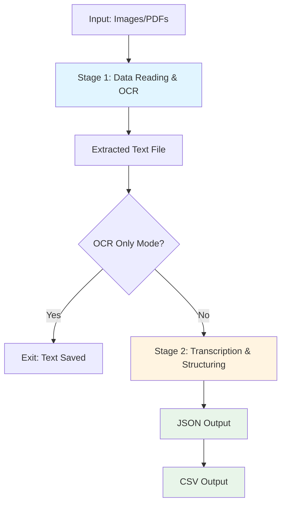

# LightfootCatalogue Pipeline Structure & Flow

## Overview
The pipeline converts historical botanical catalogue page images into structured JSON/CSV data through a two-stage process involving OCR extraction and LLM-based transcription.

---

## Pipeline Architecture



---

## Detailed Component Flow

### **Entry Point: run.py**

```
┌─────────────────────────────────────┐
│         run.py main()               │
│  - Parse CLI arguments              │
│  - Load prompt configuration        │
│  - Create output directories        │
└──────────┬──────────────────────────┘
           │
           ▼
    ┌──────────────┐
    │run_pipeline()│
    └──────┬───────┘
           │
           ├──► Stage 1: run_stage_1()
           │
           └──► Stage 2: run_stage_2()
```

---

## Stage 1: Data Reading & OCR

### **Class: DataReader** (`lightcat/data_processing/data_reader.py`)

```
Input: Image directory or PDF
  │
  ├─► load_files()
  │   ├─► PDF detected? → pdf_to_images()
  │   │   └─► Convert PDF to PNG images (600 DPI)
  │   └─► Gather all image files (.jpg, .png, .jpeg)
  │
  ├─► get_data()
  │   ├─► Check for existing extracted/cropped images
  │   ├─► If crop=True:
  │   │   └─► ImageProcessor()
  │   │       ├─► Detect double pages
  │   │       ├─► Split into separate images
  │   │       ├─► Crop middle margins
  │   │       ├─► Remove background noise
  │   │       ├─► Resize by factor
  │   │       └─► Save to cropped/ directory
  │   └─► Return image directory path
  │
  └─► __call__()
      ├─► Check for existing extracted_text.txt
      │   └─► If exists: Load and return
      │
      └─► OCRModel()
          ├─► Layout Detection (YOLOv8)
          │   └─► Identify text regions/columns
          │
          ├─► Tesseract OCR
          │   └─► Extract text from regions
          │
          ├─► Optional: OCR Cleanup Model
          │   └─► Mistral7B cleans OCR errors
          │
          └─► Save to extracted_text.txt

Output: Extracted text string
```

### **Key Components in Stage 1**

#### **ImageProcessor** (`lightcat/data_processing/image_processor.py`)
- **Purpose**: Preprocess double-page images
- **Operations**:
  - Split double pages into single pages
  - Crop middle margins (configurable percentage)
  - Remove background noise (small objects)
  - Resize maintaining aspect ratio
  - Add padding for processing

#### **OCRModel** (`lightcat/models/ocr_model.py`)
- **Purpose**: Extract text from images
- **Components**:
  1. **Layout Detection**: YOLOv8 model identifies text regions
  2. **Tesseract OCR**: Extracts text maintaining layout
  3. **Cleanup Model** (optional): Mistral7B corrects OCR errors

---

## Stage 2: Transcription & Structuring

### **Class: TranscriptionModel** (`lightcat/models/transcription_model.py`)

```
Input: Extracted text string
  │
  ├─► TextProcessor.process()
  │   ├─► layout_detection.classify_lines()
  │   │   └─► Identify divisions, families, species
  │   │
  │   ├─► chunker.chunk()
  │   │   ├─► Split text into logical blocks
  │   │   ├─► Group by divisions (Dicotyledones, etc.)
  │   │   ├─► Group by families (ACERACEAE, etc.)
  │   │   └─► Preserve hierarchical structure
  │   │
  │   └─► Return structured text blocks
  │       Format: [{"division": "...", "family": "...", "content": "..."}]
  │
  └─► inference()
      │
      ├─► For each text block:
      │   │
      │   ├─► PromptBuilder.get_conversation()
      │   │   └─► Inject family + content into prompt template
      │   │
      │   ├─► LLM Model (Qwen2-VL/Mistral)
      │   │   └─► Convert text to JSON following schema
      │   │
      │   ├─► verify_json()
      │   │   ├─► Validate against Pydantic schema
      │   │   ├─► Check JSON syntax
      │   │   └─► If invalid → Error correction prompt
      │   │
      │   └─► Accumulate valid JSON blocks
      │
      ├─► save_json()
      │   └─► Write to {output_name}.json
      │
      └─► save_csv_from_json()
          └─► Flatten and write to {output_name}.csv

Output: JSON file + CSV file
```

### **Key Components in Stage 2**

#### **TextProcessor** (`lightcat/data_processing/text_processing.py`)
- **Purpose**: Parse and chunk extracted text
- **Methods**:
  - Classify lines (division/family/species/content)
  - Chunk text by divisions and families
  - Maintain hierarchical relationships

#### **Chunker** (`lightcat/data_processing/chunker.py`)
- **Purpose**: Split text into manageable blocks
- **Strategy**: 
  - Respects max_chunk_size
  - Preserves taxonomic boundaries
  - Groups related content

#### **Layout Detection** (`lightcat/data_processing/layout_detection.py`)
- **Purpose**: Identify text types (headers, species, descriptions)
- **Uses**: Pattern matching and formatting analysis

#### **LLM Models** (`lightcat/models/hf_models/`)
- **Qwen Models**: Primary transcription models
- **Mistral Models**: OCR cleanup and error correction
- **Purpose**: Convert raw text to structured JSON

#### **JSON Schema** (`lightcat/json_schemas/default.py`)
- **BotanicalCatalogue** (Pydantic model)
  ```python
  {
    "family_name": str,
    "species": [
      {
        "species_name": str,
        "number_of_folders": int,
        "number_of_sheets": int,
        "folders_and_sheets": [
          {"description": str}
        ]
      }
    ]
  }
  ```

---

## Configuration Flow

### **PromptLoader** (`lightcat/utils/prompt_utils.py`)

```
User YAML Prompt File
  │
  ├─► Load configuration keys
  │   ├─► model name
  │   ├─► temperatures
  │   ├─► batch_size
  │   ├─► max_tokens
  │   ├─► image preprocessing params
  │   └─► output paths
  │
  ├─► Load prompt templates
  │   ├─► system setup
  │   ├─► instructions
  │   ├─► rules for each JSON field
  │   ├─► schema definition
  │   ├─► examples (few-shot learning)
  │   └─► user prompt template
  │
  ├─► inherit_default?
  │   └─► Merge with default.yaml
  │
  └─► Load divisions list
      └─► ["Dicotyledones", "Monocotyledones", ...]
```

---

## Data Flow Summary

```
┌─────────────────────────────────────────────────────────────┐
│                    INPUT PHASE                              │
├─────────────────────────────────────────────────────────────┤
│ Images/PDFs → load_files() → [list of image paths]         │
└────────────────────────┬────────────────────────────────────┘
                         │
┌────────────────────────▼────────────────────────────────────┐
│               IMAGE PREPROCESSING                           │
├─────────────────────────────────────────────────────────────┤
│ Raw Images → ImageProcessor                                 │
│   ├─► Split double pages                                    │
│   ├─► Crop margins                                          │
│   ├─► Remove noise                                          │
│   ├─► Resize                                                │
│   └─► Save to cropped/                                      │
└────────────────────────┬────────────────────────────────────┘
                         │
┌────────────────────────▼────────────────────────────────────┐
│                  OCR EXTRACTION                             │
├─────────────────────────────────────────────────────────────┤
│ Preprocessed Images → OCRModel                              │
│   ├─► YOLOv8 layout detection                              │
│   ├─► Tesseract OCR                                         │
│   ├─► Optional Mistral cleanup                             │
│   └─► extracted_text.txt                                    │
└────────────────────────┬────────────────────────────────────┘
                         │
                  ┌──────▼──────┐
                  │ OCR Only?   │
                  └──┬───────┬──┘
                     │Yes    │No
                     │       │
                 [EXIT]      │
                             │
┌────────────────────────────▼────────────────────────────────┐
│                TEXT PROCESSING                              │
├─────────────────────────────────────────────────────────────┤
│ Raw Text → TextProcessor                                    │
│   ├─► Classify lines (division/family/species)             │
│   ├─► Chunk by divisions and families                      │
│   └─► [{"division": "...", "family": "...", "content"}]    │
└────────────────────────┬────────────────────────────────────┘
                         │
┌────────────────────────▼────────────────────────────────────┐
│              LLM TRANSCRIPTION                              │
├─────────────────────────────────────────────────────────────┤
│ Text Blocks → TranscriptionModel                            │
│   For each block:                                           │
│   ├─► Build prompt with schema                             │
│   ├─► LLM inference (Qwen2-VL)                             │
│   ├─► JSON validation                                      │
│   ├─► Error correction if needed                           │
│   └─► Accumulate results                                    │
└────────────────────────┬────────────────────────────────────┘
                         │
┌────────────────────────▼────────────────────────────────────┐
│                OUTPUT GENERATION                            │
├─────────────────────────────────────────────────────────────┤
│ Organized Data → Save Functions                             │
│   ├─► save_json() → output.json                            │
│   ├─► save_csv_from_json() → output.csv                    │
│   └─► Error logs → *_errors.txt                            │
└─────────────────────────────────────────────────────────────┘
```

---

## File System Structure During Execution

```
input_directory/
├─► images/
│   ├─► page_001.jpg
│   ├─► page_002.jpg
│   └─► ...
│
├─► extracted_images/        # Created if input is PDF
│   ├─► doc_1.png
│   ├─► doc_2.png
│   └─► cropped/             # Created if crop=True
│       ├─► doc_1_0.png
│       ├─► doc_1_1.png
│       └─► ...
│
├─► cropped/                 # Created if crop=True (non-PDF)
│   └─► ...
│
└─► extracted_text.txt       # Cached OCR output

outputs/{catalogue_name}/
├─► {name}.json              # Structured botanical data
├─► {name}.csv               # Flattened tabular data
├─► {name}_errors.txt        # JSON validation errors
└─► logs/                    # Execution logs
```

---

## Key Decision Points

### 1. **Existing Files Check**
- **extracted_text.txt exists?** → Skip OCR, load text
- **cropped/ directory exists?** → Skip preprocessing, use cached images
- **extracted_images/ exists?** → Use extracted PDF images

### 2. **Processing Modes**
- **--ocr-only flag**: Stop after Stage 1
- **--test flag**: Process only first 5000 characters
- **crop=True**: Enable image preprocessing
- **crop=False**: Use original images

### 3. **Error Handling**
- **Invalid JSON?** → Send to error correction prompt
- **Still invalid?** → Log to *_errors.txt, continue
- **No images found?** → Raise FileNotFoundError

---

## Configuration Parameters

### Image Processing
- `crop`: Enable/disable preprocessing (bool)
- `padding`: Padding for cropped images (float)
- `resize_factor`: Image resize ratio (float)
- `remove_area_perc`: Noise removal threshold (float)
- `middle_margin_perc`: Middle margin crop percentage (float)
- `double_pages`: Expect double-page layout (bool)
- `has_columns`: Text in columns (bool)

### OCR Settings
- `ocr_model`: Model for OCR cleanup ("mistral7b")
- `ocr_temperature`: Temperature for OCR model (float)

### Transcription Settings
- `model`: LLM model name ("qwen2")
- `transcription_temperature`: LLM temperature (float)
- `max_tokens`: Maximum output tokens (int)
- `max_chunk_size`: Text chunk size (int)
- `batch_size`: Processing batch size (int)
- `timeout`: Retry attempts for errors (int)

### Output Settings
- `output_save_path`: Directory for outputs (str)
- `output_save_file_name`: Base name for output files (str)

---

## Module Dependencies

```
run.py
  ├─► lightcat.data_processing.data_reader.DataReader
  │     ├─► lightcat.data_processing.image_processor.ImageProcessor
  │     └─► lightcat.models.ocr_model.OCRModel
  │           └─► lightcat.data_processing.layout_detection
  │
  └─► lightcat.models.transcription_model.TranscriptionModel
        ├─► lightcat.data_processing.text_processing.TextProcessor
        │     ├─► lightcat.data_processing.chunker
        │     └─► lightcat.data_processing.layout_detection
        │
        ├─► lightcat.models.hf_models.[qwen|mistral]_models
        │
        └─► lightcat.utils.save_utils
              ├─► save_json()
              └─► save_csv_from_json()

lightcat.utils.prompt_utils.PromptLoader
  ├─► Load YAML configuration
  └─► lightcat.json_schemas.default
```

---

## Execution Examples

### Full Pipeline
```bash
python run.py \
    resources/images/lightfootcat \
    resources/prompts/lightfootcat_prompt.yaml \
    --savefilename lightfootcat_output
```

### OCR Only
```bash
python run.py \
    resources/images/hanbury \
    resources/prompts/hanbury_prompt.yaml \
    --ocr-only
```

### Test Mode (First 5000 chars)
```bash
python run.py \
    resources/images/lightfootcat \
    resources/prompts/lightfootcat_prompt.yaml \
    --test
```

---

## Performance Optimization

### Caching Strategy
1. **extracted_text.txt**: Cache OCR results to avoid re-extraction
2. **cropped/ directory**: Cache preprocessed images
3. **extracted_images/**: Cache PDF conversion results

### Parallel Processing
- Batch processing controlled by `batch_size` parameter
- GPU acceleration for YOLOv8 and LLM inference

### Memory Management
```python
os.environ["PYTORCH_CUDA_ALLOC_CONF"] = "expandable_segments:True"
os.environ["TORCH_USE_CUDA_DSA"] = "1"
```

---

## Error Recovery

### JSON Validation Loop
```
1. LLM generates JSON
2. verify_json() checks validity
3. If invalid → Send to error correction prompt
4. Re-validate
5. If still invalid → Log error, continue with next block
```

### Logged Errors
- `{name}_errors.txt`: Family/division names where JSON failed validation
- Allows manual inspection and correction post-processing

---

## Output Schema Example

### JSON Structure
```json
{
  "family_name": "ACERACEAE",
  "species": [
    {
      "species_name": "Acer campestre L.",
      "number_of_folders": 1,
      "number_of_sheets": 0,
      "folders_and_sheets": [
        {
          "description": "Acer campestre [TA]"
        }
      ]
    }
  ]
}
```

### CSV Structure (Flattened)
```csv
family_name,species_name,number_of_folders,number_of_sheets,description
ACERACEAE,Acer campestre L.,1,0,Acer campestre [TA]
```

---

## System Requirements

- **Python 3.8+**
- **CUDA-capable GPU** (recommended for YOLOv8 and LLMs)
- **Tesseract OCR** installed
- **conda** environment manager
- **Hugging Face models**: Qwen2-VL, Mistral7B
- **YOLOv8** for layout detection

---

## Pipeline Metrics

### Processing Time (Estimates)
- **Manual processing**: ~6-8 minutes/page
- **Automated pipeline**: Significantly faster (dependent on GPU)

### Stages Breakdown
1. **Image preprocessing**: ~seconds per page
2. **OCR extraction**: ~30-60 seconds per page
3. **LLM transcription**: ~1-2 minutes per page (depends on content size)

---

This pipeline efficiently transforms unstructured historical botanical catalogue images into structured, queryable databases suitable for research, digitization, and preservation.
