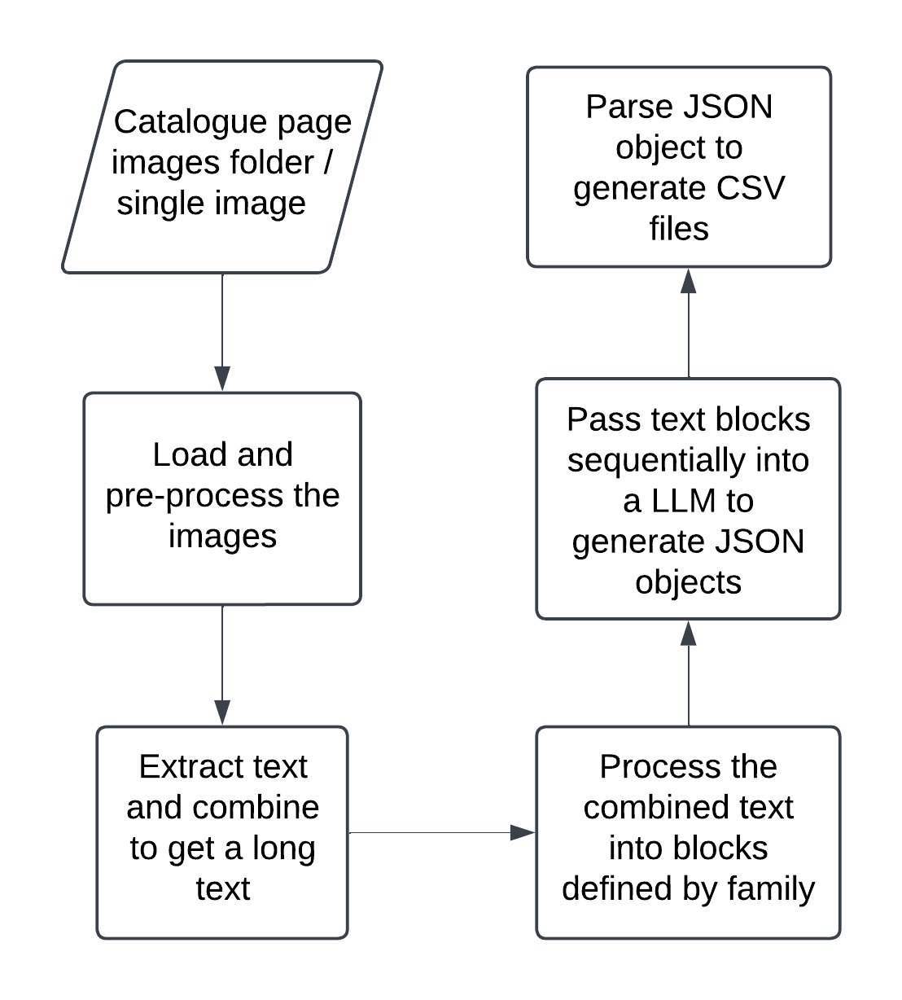

# LightfootCatalogue

## Aim

The aim of this project is to efficiently convert taxonomic data from page images of the Lighfoot catalogue into structured data.

The catalogue is ordered taxonomically with headings for family and species then indented details of the folder contents. The page images are shared in sequential order. 
Manual processing of the page images takes about 40 minutes / page.

## Approach
<p align="center">
    
</p>
The page images are passed through a pipeline that extracts the text and organises them into a JSON and CSV file. As shown on the flowchart above, the pipeline goes through multi-pre-processing steps before passing text blocks into the model for organising.

Intial pages are generally of the below format. These images are pre processed to generate two single zoomed images. These individual images are resized with respect to aspect ratio and have any background noise removed.

Page image:
<p align="center">
    
</p>

## Installation

1. Clone the repository on your local device

```
git clone https://github.com/KewBridge/LightfootCatalogue.git
```
[OPTIONAL STEPS - If running on a HPC cluster]
1. Connect to the HPC cluster
2. Request a partition
```
srun --partition=gpu --gpus=1 --mem=80G --cpus-per-task=4 --pty bash
```
2. Run installation script (assuming conda is installed in your local device)
```
./install_req.sh
```
3. Activate conda environment if not already activated
```
conda activate <input your conda env name>
```

4. Run program from root
```
python run.py \
    <path to image/image directory> \
    <path to prompt> \
    --savefilename [name for the save file]\
    --temp-text [any text file you want to transcribe]\
    --model [Name of model to use for transcription]\
    --ocr-only [Add this flag only if you want OCR of images]\
    --test [Add this flag only if you want to do a quick test]
```
To run the program post installation, follow steps 3 and 4 after navigating to project directory on your local device / HPC account. Do not forget to request a partition if using HPC cluster.

## Defining user prompts

User prompts are found under **prompts** folder. A user prompt is imperative to define the output structure of the JSON file and subsequently the CSV file. These prompts are defined in a YAML file and can be created following the structure below. We have provided a default script to inherit from and two scripts each for lightfoot and hanbury catalogue.

To define a working user prompts, you must include the **configuration keys**, **inherit_default**, **default_file**, **divisions**, **system** and **user**.

| Configuration Key | Description | Example Value |
|-------------------|-------------|--------------|
| `model`           | Name of the model to use for transcription | `"qwen2"` |
| `output_save_file_name` | Name for the output save file | `"default"` |
| `max_tokens`      | Maximum number of tokens for model output | `4096` |
| `max_chunk_size`  | Maximum size of each chunk for processing | `3000` |
| `output_save_path`| Directory to save the output files | `"outputs/default/"` |
| `batch_size`      | Number of items to process in a batch | `1` |
| `ocr_model`       | Name of the OCR model to use. Recommending mistral model for OCR clean up. | `"mistral7b"` |
| `ocr_temperature` | Temperature setting for OCR model | `0.1` |
| `transcription_temperature` | Temperature setting for transcription model | `0.1` |
| `timeout`         | Number of tries before timeout | `4` |
| `crop`            | Whether to crop images before processing | `True` |
| `padding`         | Padding to apply when cropping images | `100.0` |
| `resize_factor`   | Factor to resize images by | `0.4` |
| `remove_area_perc`| Percentage of area to remove as noise | `0.01` |
| `middle_margin_perc` | Percentage for middle margin cropping | `0.20` |
| `has_columns`     | Whether the page images have columns | `True` |
| `inherit_default` | Whether to inherit missing keys from a default file | `True` or `False` |
| `default_file`    | Path to the default file to inherit from, or `None` | `None` or `prompts/default.yaml` |
| `divisions`       | List of division names to look for in the pages | `["Dicotyledones", "Monocotyledones"]` |
| `system`          | Main set of instructions for the model | See example below |
| `user`            | User prompt/input, must include `{extracted_text}` placeholder | See example below |

**divisions** takes a list of all page/text divisions to look out for in the pages. These include any one time category names that are optional and not needed. RECOMMENDED to fill this with all the names of the divisions in the images.

```
# This list contains division names for the Lightfoot Catalogue
divisions: ["Dicotyledones", "Monocotyledones", "Pteridophyta", "Hepaticae", "Algae"]
```

**system**, is the main set of instructions to the model. Define this as you see fit for your purpose. Must include setup, which defines what topic the model should focus on for this task. RECOMMENDED to structure your instructions and not to include long instructions. The below example is for the Lightfoot Catalogue.

```
system:
  # Setup defines the model setup prompt. This lets the model know what area of knowledge to focus on for this task
  setup: >
    You are a system that converts botanical text into strictly valid JSON.
  # context defines the context of the task. This includes the input to the model and the description of said input
  # instructions define the step-by-step instructions for the model to follow through
  instructions: |
    Reformat the following botanical text exactly into JSON according to the provided schema.
    Do not generate any extra text, explanations, or markdown formatting. Your output must be a single JSON object with no surrounding commentary or formatting.
    Follow the rules exactly as provided, ensuring that:
      - All keys are correctly quoted.
      - There are no trailing commas.
      - Only the data from the input is reorganized; do not modify or add any content.
  # rules define the key-value rules for each expected key in the output json dict
  rules:
    familyName: >
      The scientific family name in uppercase. If not available, use "N/A".
    species: >
      A list of dictionaries for each species under the family. Each dictionary should include:
      - speciesName: The full scientific name as written in the text.
      - folderNo: An integer representing the number of folders for that species.
      - folders: A list of dictionaries, each containing:
           - description: A description of the folder contents.

  # schema defines the output json structure
  schema: |
    {
      "familyName": "<extracted family name>", 
      "species": [ 
        {
          "speciesName": "<extracted species name>",
          "folderNo": <extracted number of folders>,
          "folders": [ 
            {
              "description": "<extracted description>"
            }
          ]    
        }
      ]
    }

  examples: 
    - input: |
        ACERACEAE

        Acer campestre L.

        1 folder. Acer campestre [TA]

        Acer pseudoplatanus L.

        2 folders.

        Folder 1. Acer Pseudo-Platanus [G]. i. "Maple. Bulls: [Bulstrode] Park" [JL]

        Folder 2. Acer Pseudo-Platanus [TA].
    - output: |
        {
        "familyName": "ACERACEAE", 
        "species": [ 
            {
              "speciesName": "Acer campestre L.",
              "folderNo": 1,
              "folders": [ 
                    {
                      "description": "Acer campestre [TA]"
                    }
              ]    
            },
            {
              "speciesName": "Acer pseudoplatanus L.",
              "folderNo": 2,
              "folders": [
                    {
                      "description": "Folder 1. Acer Pseudo-Platanus [G]. i. \"Maple. Bulls: [Bulstrode] Park\" [JL]"
                    },
                    {
                      "description": "Folder 2. Acer Pseudo-Platanus [TA]."
                    },
              ]
            }
          ]
        }
```

**user** defines the user prompt/input, this can be as simple as a simple sentence. Must use place holder {extracted_text} when defining to pass extracted to the prompt. RECOMMENDED to follow below structure for optimised performace.

```
# user defines the user input. This can contain more than one prompt. 
# Different prompts will be passed to the model as individual inputs
user:
  # the prompt defines the user's prompt to the model
  text: | 
   Reformat the text below exactly into JSON according to the schema provided.
    Only output the JSON object and nothing else.
  
   Extracted text:
   {extracted_text} 
``` 

## Scheduling tasks on SLURM

Currently three SLURM scheduling scripts are provided in the [`resources/slurm_jobs`](./resources/slurm_jobs) directory. Ensure you change the name of the environment (to the one you defined during installation) in each script before using. If working with new catalogues, not provided by us, you will have to edit the script to use it. 

SLURM script find and edit line: `source activate <Add your environment name>`

Make script is also available. 

```
submit -> submit full run script to SLURM. Provide name of catalogue.
submit_ocr -> submit ocr only script to SLURM. Provide name of catalogue.
clean -> Clean up any slurm output files (file ending .out)
clean_submit -> Runs clean, and submits full script for lightfoot and hanbury (can add more later for custom prompts)
clean_submit_ocr -> Runs clean, and submits ocr only script for lightfoot and hanbury (can add more later for custom prompts)
```

## Team

- [Marie-Helene Weech](https://github.com/Cupania) (RBG Kew, digitisation)
- Priscila Reis (RBG Kew, senior curator-botanist)
- [Nicky Nicolson](https://github.com/nickynicolson) (RBG Kew, digital collections)
- [Ishaipiriyan Karunakularatnam](https://github.com/ipiriyan2002) (RBG Kew, digital research associate)
