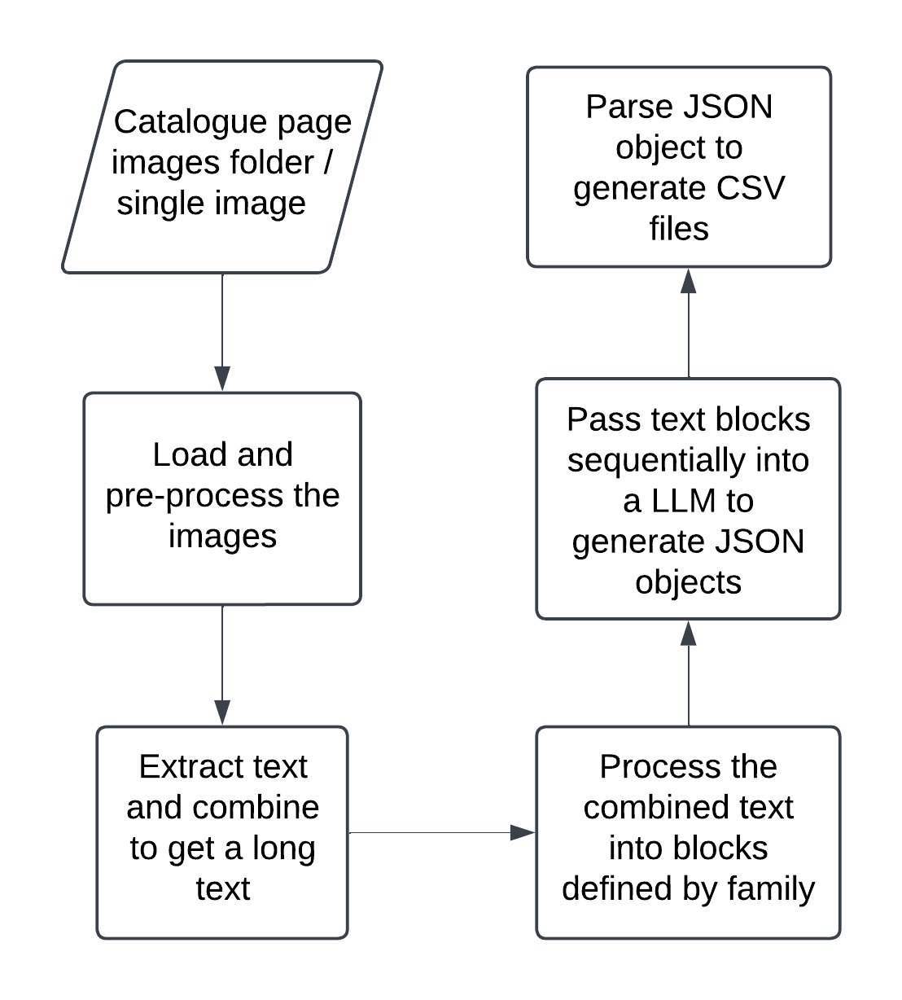

# LightfootCatalogue

## Aim

The aim of this project is to efficiently convert taxonomic data from page images of the Lighfoot catalogue into structured data.

The catalogue is ordered taxonomically with headings for family and species then indented details of the folder contents. The page images are shared in sequential order. 
Manual processing of the page images takes about 40 minutes / page.

## Approach
<p align="center">
    
</p>
The page images are passed through a pipeline that extracts the text and organises them into a JSON and CSV file. As shown on the flowchart above, the pipeline goes through multi-pre-processing steps before passing text blocks into the model for organising.

Intial pages are generally of the below format. These images are pre processed to generate two single zoomed images. These individual images are resized with respect to aspect ratio and have any background noise removed.

Page image:
<p align="center">
    
</p>

## Installation

1. Clone the repository on your local device

```
git clone https://github.com/KewBridge/LightfootCatalogue.git
```
[OPTIONAL STEPS - If running on a HPC cluster]
1. Connect to the HPC cluster
2. Request a partition
```
srun --partition=gpu --gpus=1 --mem=80G --cpus-per-task=4 --pty bash
```
2. Create a conda environment (assuming conda is installed in your local device, if not follow this link for [Crop Diversity HPC](https://help.cropdiversity.ac.uk/bioconda.html))
```
conda create --name <input your conda env name> --file=./requirements.yml
```
3. Activate conda environment
```
conda activate <input your conda env name>
```
4. Run program from root
```
python run.py "<path to image/image directory>" <path to prompt> <save-file-name> [temp-text-file] --max-tokens [maximum tokens for model] --max-chunk-size [maximum size of each text block. Default 3000] --save-path [path to save the jsons] --batch [Batch size. Default 1] --crop [Crop and pre-process the images or not. Default True]
```

To run the program post installation, follow steps 3 and 4 after navigating to project directory on your local device / HPC account. Do not forget to request a partition if using HPC cluster.

## Defining user prompts

User prompts are found under **prompts** folder. A user prompt is imperative to define the output structure of the JSON file and subsequently the CSV file. These prompts are defined in a YAML file and can be created following the structure below.

To define a working user prompts, you must include the keys **inherit_default**, **default_file**, **divisions**, **system** and **user**.

**inherit_default** takes either True or False. This defined if your prompt should inherit anything missing from a default file. RECOMMENDED to leave it as False, especially if **default_file** is None.
```
inherit_default: <True/False> 
```

**default_file** takes the relative path to the default file to inherit any missing keys from. You can leave it as None or the path to default file.
```
default_file: <None/path-to-default-file>
```

**divisions** takes a list of all page/text divisions to look out for in the pages. These include any one time category names that are optional and not needed. RECOMMENDED to fill this with all the names of the divisions in the images.

```
# This list contains division names for the Lightfoot Catalogue
divisions: ["Dicotyledones", "Monocotyledones", "Pteridophyta", "Hepaticae", "Algae"]
```

**system**, is the main set of instructions to the model. Define this as you see fit for your purpose. Must include setup, which defines what topic the model should focus on for this task. RECOMMENDED to structure your instructions and not to include long instructions. The below example is for the Lightfoot Catalogue.

```
system:
  # Setup defines the model setup prompt. This lets the model know what area of knowledge to focus on for this task
  setup: >
    You are an expert in organising text into JSON. You have extensive knowledge in taxonomy and about botancial collections. 
  # context defines the context of the task. This includes the input to the model and the description of said input
  goal: >
    Your task is to organise the given text and format it into a JSON object that follows the provided structure and specific formatting rules.
  # instructions define the step-by-step instructions for the model to follow through
  instructions: |
    
    1) **Identify Family Names**:
       - Each family name is written in uppercase (e.g., "ACERACEAE").
       - Store it as `familyName` in the JSON structure.

    2) **Identify Species**:
       - Species names appear in italics and are typically followed by an author abbreviation (e.g., "Acer campestre L.").
       - Store each as `speciesName` under its respective `familyName`.

    3) **Capture Folder Details**:
       - Each species may have one or more folders labeled as "Folder X" with a following description.
       - Extract the folder number and description. 

    4) **Validation**:
       - Leave fields empty or set to "N/A" if information is not available.
       - Do not perform grammar checks or corrections.
    
    5) Ensure JSON is valid with no trailing commas or unquoted keys.
    6) Avoid duplicate keys and ensure all keys are in camelCase.

  # rules define the key-value rules for each expected key in the output json dict
  rules:
    familyName: >
      The scientific family name in uppercase. If not available, set as "N/A". 
    species: A list of dictionaries for each species under the family, containing `speciesName` and `folders`.
    speciesName: >
      The full scientific name of the species as written in the image. No corrections.
    folders: A list of dictionaries, each representing a folder with `description`.
    description: >
      A description of the folder contents, including location or collection details.

  # template defines the output json structure
  template: |
    {
      "familyName": "", 
      "species": [ 
            {
                "speciesName": "",
                "folders": [ 
                      {
                        "description": "",
                      }
                ],
                
            }
                ]
    }
```

**user** defines the user prompt/input, this can be as simple as a simple sentence. Must use place holder {extracted_text} when defining to pass extracted to the prompt. RECOMMENDED to follow below structure for optimised performace.

```
# user defines the user input. This can contain more than one prompt. 
# Different prompts will be passed to the model as individual inputs
user:
  # the prompt defines the user's prompt to the model
  text: Given the {extracted_text}, organise it into a JSON object as outlined by the rules and instructions. 
``` 


## Team

- [Marie-Helene Weech](https://github.com/Cupania) (RBG Kew, digitisation)
- Priscila Reis (RBG Kew, senior curator-botanist)
- [Nicky Nicolson](https://github.com/nickynicolson) (RBG Kew, digital collections)
- [Piriyan Karunakularatnam](https://github.com/ipiriyan2002) (RBG Kew, digital research associate)
