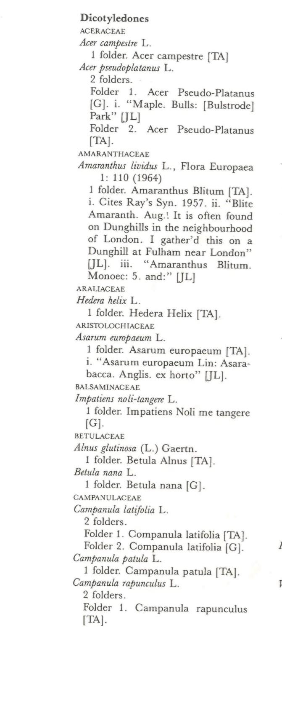

# LightfootCatalogue


## Aim

Convert page images from the Lightfoot catalogue into data. The catalogue is ordered taxonomically with headings for family and species then indented details of the folder contents. 
Manual processing of the page images takes about 40 minutes / page.

## Approach

The page images could be passed to a language model like QWEN with an instruction to read the information and extract in a structured form.

It is possible to experiment with QWEN using a huggingface space: https://huggingface.co/spaces/KingNish/Qwen2-VL-7B - but the model could be run on our HPC infrastructure (https://cropdiversity.ac.uk)

An example:

Page image:



Prompt:

```
Process this image in two steps:

Step 1: Turn the text in this picture into markdown. Indicate italics. Indent lines which discuss folder contents as unordered lists

Step 2: Convert the markdown text that you created in step 1 into JSON. Use the heading texts as keys, and the folder details as nested numbered lists

Your output should consist of the markdown text, then a fenced JSON code block
```

Output:
```
### Dicotyledones

#### ACERACEAE

- **Acer campestre L.**
  - 1 folder. Acer campestre [TA]
- **Acer pseudoplatanus L.**
  - 2 folders.
    - Folder 1. Acer Pseudo-Platanus [G]. i. "Maple. Bulls: [Bulstrode] Park" [JL]
    - Folder 2. Acer Pseudo-Platanus [TA].

#### AMARANTHACEAE

- **Amaranthus lividus L., Flora Europaea 1: 110 (1964)**
  - 1 folder. Amaranthus Blitum [TA].
    - i. Cites Ray's Syn. 1957. ii. "Blite Amaranth. Aug! It is often found on Dunghills in the neighbourhood of London. I gather'd this on a Dunghill at Fulham near London" [JL]. iii. "Amaranthus Blitum. Monoec: 5. and:" [JL]

#### ARALIACEAE

- **Hedera helix L.**
  - 1 folder. Hedera Helix [TA].

#### ARISTOLOCHIACEAE

- **Asarum europaeum L.**
  - 1 folder. Asarum europaeum [TA].
    - i. "Asarum europaeum Lin: Asarabacca. Anglis. ex horto" [JL].

#### BALSAMINACEAE

- **Impatiens noli-tangere L.**
  - 1 folder. Impatiens Noli me tangere [G].

#### BETULACEAE

- **Alnus glutinosa (L.) Gaertn.**
  - 1 folder. Betula Alnus [TA].
- **Betula nana L.**
  - 1 folder. Betula nana [G].

#### CAMANULACEAE

- **Campanula latifolia L.**
  - 2 folders.
    - Folder 1. Companula latifolia [TA].
    - Folder 2. Companula latifolia [G].
- **Campanula patula L.**
  - 1 folder. Campanula patula [TA].
- **Campanula rapunculus L.**
  - 2 folders.
    - Folder 1. Campanula rapunculus [TA].
```

```json
{
  "ACERACEAE": [
    {
      "Acer campestre L.": [
        {
          "folder": "Acer campestre [TA]"
        }
      ]
    },
    {
      "Acer pseudoplatanus L.": [
        {
          "folder": "Acer Pseudo-Platanus [G]. i. \"Maple. Bulls: [Bulstrode] Park\" [JL]"
        },
        {
          "folder": "Acer Pseudo-Platanus [TA]"
        }
      ]
    }
  ],
  "AMARANTHACEAE": [
    {
      "Amaranthus lividus L., Flora Europaea 1: 110 (1964)": [
        {
          "folder": "Amaranthus Blitum [TA]. i. Cites Ray's Syn. 1957. ii. \"Blite Amaranth. Aug! It is often found on Dunghills in the neighbourhood of London. I gather'd this on a Dunghill at Fulham near London\" [JL]. iii. \"Amaranthus Blitum. Monoec: 5. and:\" [JL]"
        }
      ]
    }
  ],
  "ARALIACEAE": [
    {
      "Hedera helix L.": [
        {
          "folder": "Hedera Helix [TA]"
        }
      ]
    }
  ],
  "ARISTOLOCHIACEAE": [
    {
      "Asarum europaeum L.": [
        {
          "folder": "Asarum europaeum [TA]. i. \"Asarum europaeum Lin: Asarabacca. Anglis. ex horto\" [JL]"
        }
      ]
    }
  ],
  "BALSAMINACEAE": [
    {
      "Impatiens noli-tangere L.": [
        {
          "folder": "Impatiens Noli me tangere [G]"
        }
      ]
    }
  ]
}
```
## To run the program
```
1. Connect to the HPC cluster
2. Request a partition
>>> srun --partition=gpu --gpus=1 --mem=80G --cpus-per-task=4 --pty bash
3. Create a conda environment (assuming conda is installed in your HPC cluster, if not follow this link https://help.cropdiversity.ac.uk/bioconda.html)
>>> conda create --name <input your conda env name> --file=./requirements.yml
4. Activate conda environment
>>> conda activate <input your conda env name>
5. Run program from root
>>> python run.py "<path to image/image directory>"
```

## Team

- [Marie-Helene Weech](https://github.com/Cupania) (RBG Kew, digitisation)
- Priscila Reis (RBG Kew, senior curator-botanist)
- [Nicky Nicolson](https://github.com/nickynicolson) (RBG Kew, digital collections)
- [Piriyan Karunakularatnam](https://github.com/ipiriyan2002) (RBG Kew, digital research associate)
